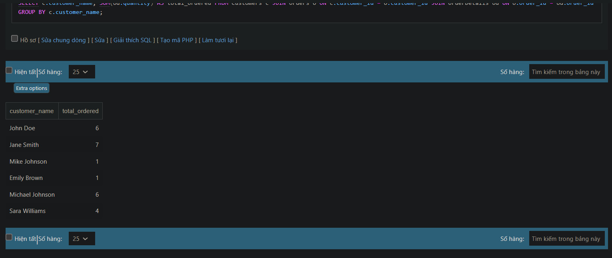

### Final Test SQL
1. Lấy thông tin tất cả các sản phẩm đã được đặt trong một đơn đặt hàng cụ thể.
```sql
SELECT p.product_id, p.product_name, p.price
FROM Products p
JOIN OrderDetails od ON p.product_id = od.product_id
WHERE od.order_id = 301;
```


2. Tính tổng số tiền trong một đơn đặt hàng cụ thể.
```sql
SELECT SUM(p.price * od.quantity) AS total_amount
FROM Products p
JOIN OrderDetails od ON p.product_id = od.product_id
WHERE od.order_id = 301;
```


3. Lấy danh sách các sản phẩm chưa có trong bất kỳ đơn đặt hàng nào.
```sql
SELECT p.product_id, p.product_name
FROM Products p
LEFT JOIN OrderDetails od ON p.product_id = od.product_id
WHERE od.order_id IS NULL;
```


4. Đếm số lượng sản phẩm trong mỗi danh mục. (category_name, total_products)
```sql
SELECT c.category_name, COUNT(p.product_id) AS total_products
FROM Categories c
LEFT JOIN Products p ON c.category_id = p.category_id
GROUP BY c.category_name;
```


5. Tính tổng số lượng sản phẩm đã đặt bởi mỗi khách hàng (customer_name, total_ordered)
```sql
SELECT c.customer_name, SUM(od.quantity) AS total_ordered
FROM Customers c
JOIN Orders o ON c.customer_id = o.customer_id
JOIN OrderDetails od ON o.order_id = od.order_id
GROUP BY c.customer_name;
```


6. Lấy thông tin danh mục có nhiều sản phẩm nhất (category_name, product_count)
```sql
SELECT c.category_name, COUNT(p.product_id) AS product_count
FROM Categories c
JOIN Products p ON c.category_id = p.category_id
GROUP BY c.category_name
ORDER BY product_count DESC
LIMIT 1;
```


7. Tính tổng số sản phẩm đã được đặt cho mỗi danh mục (category_name, total_ordered)
```sql
SELECT c.category_name, SUM(od.quantity) AS total_ordered
FROM Categories c
JOIN Products p ON c.category_id = p.category_id
JOIN OrderDetails od ON p.product_id = od.product_id
GROUP BY c.category_name;
```


8.Lấy thông tin về top 3 khách hàng có số lượng sản phẩm đặt hàng lớn nhất (customer_id, customer_name, total_ordered)
```sql
SELECT c.customer_id, c.customer_name, SUM(od.quantity) AS total_ordered
FROM Customers c
JOIN Orders o ON c.customer_id = o.customer_id
JOIN OrderDetails od ON o.order_id = od.order_id
GROUP BY c.customer_id, c.customer_name
ORDER BY total_ordered DESC
LIMIT 3;
```


9. Lấy thông tin về khách hàng đã đặt hàng nhiều hơn một lần trong khoảng thời gian cụ thể (customer_id, customer_name, total_orders)
```sql
SELECT c.customer_id, c.customer_name, COUNT(o.order_id) AS total_orders
FROM Customers c
JOIN Orders o ON c.customer_id = o.customer_id
WHERE o.order_date BETWEEN '2023-08-01' AND '2023-08-07'
GROUP BY c.customer_id, c.customer_name
HAVING COUNT(o.order_id) > 1;
```


10. Lấy thông tin về các sản phẩm đã được đặt hàng nhiều lần nhất và số lượng đơn đặt hàng tương ứng (product_id, product_name, total_ordered)
```sql
SELECT p.product_id, p.product_name, COUNT(DISTINCT od.order_id) AS total_ordered
FROM Products p
JOIN OrderDetails od ON p.product_id = od.product_id
GROUP BY p.product_id, p.product_name
ORDER BY total_ordered DESC
LIMIT 3;
```


