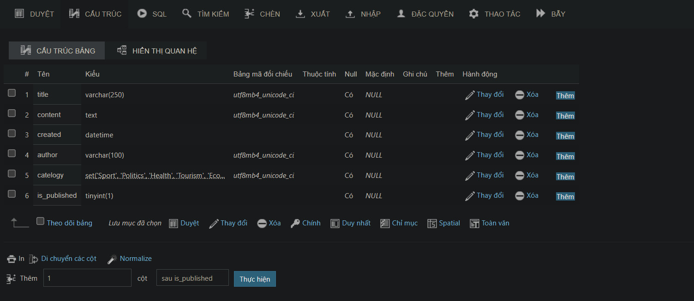
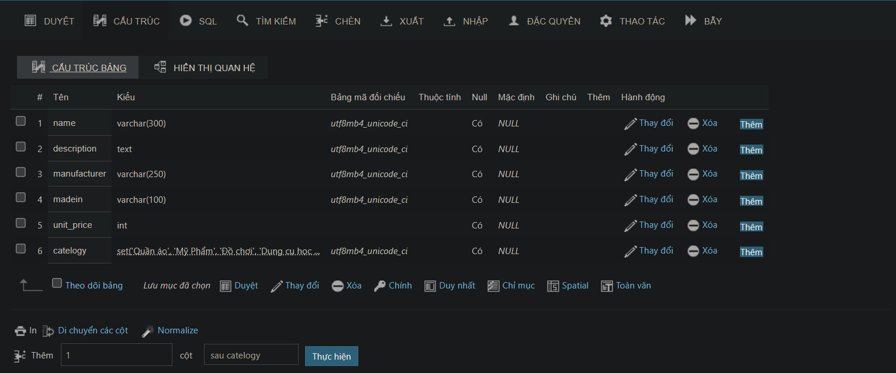
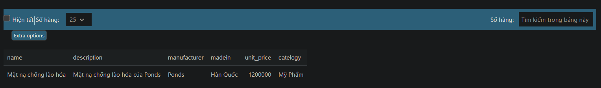

### Bài tập Về Nhà Buổi 1
A. Thiết Kế Bảng 'Post'

```sql
CREATE TABLE post(
    title VARCHAR(250),
    content TEXT,
    created DATETIME,
    author VARCHAR(100),
    catelogy SET ('Sport', 'Politics', 'Health','Tourism','Economy','Education','Technology','Science'),
    is_published BOOLEAN);
 ```
 

 B. Thiết Kế Bảng 'Product'
 ```sql

CREATE TABLE product(
    name VARCHAR(300),
    description TEXT,
    manufacturer VARCHAR(250),
    madein VARCHAR(100),
    unit_price INT,
    catelogy SET ('Quần áo', 'Mỹ Phẩm','Đồ chơi','Dụng cụ học tập','Máy Tính','Di Động','Điện Tử Dân Dụng','Văn Phòng')
);
 ```
  

  C. Chèn Bản Ghi Vào Các Bảng Vừa Tạo
  ```sql
  INSERT INTO post (title,content,created,author,catelogy,is_published) VALUES ('Tin Chuyển Nhượng', 'Manchester United đang chạy đua cực "gắt" trên thị trường chuyển nhượng hè năm nay', '2023-07-05 09:30:00', 'Dương Minh Hải', 'Sport,Politics' , 1);
INSERT INTO product (name,description,manufacturer,madein,unit_price,catelogy) VALUES ('Mặt nạ chống lão hóa', 'Mặt nạ chống lão hóa của Ponds','Ponds', 'Hàn Quốc', 1200000,'Mỹ Phẩm');
  ```
   
    
 